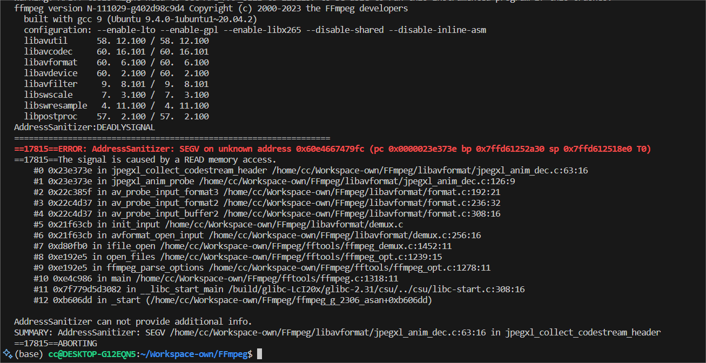

## SUMMARY

SEGV in FFmpeg N-111029-g402d98c9d4 allows a local attacker to execute arbitrary code, and cause a denial of service via the jpegxl_collect_codestream_header function in FFmpeg/libavformat/jpegxl_anim_dec.c:63

How to reproduce:

```bash
./configure --enable-lto --enable-gpl --enable-libx265 --disable-shared --disable-inline-asm --enable-debug=1
./ffmpeg_g -i ./poc ./test.mkv
```

ASAN Log:

