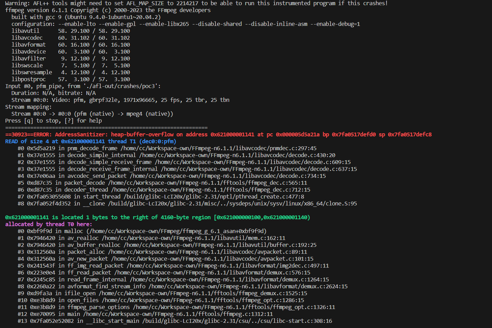

## SUMMARY

A vulnerability was found in FFmpeg up to 7.0.1. It has been classified as critical. This affects the function pnm_decode_frame in the library /libavcodec/pnmdec.c. The manipulation with an unknown input leads to a heap-based overflow vulnerability. CWE is classifying the issue as CWE-122. A heap overflow condition is a buffer overflow, where the buffer that can be overwritten is allocated in the heap portion of memory, generally meaning that the buffer was allocated using a routine such as malloc(). This is going to have an impact on confidentiality, integrity, and availability.

How to reproduce:

```bash
./configure --enable-lto --enable-gpl --enable-libx265 --disable-shared --disable-inline-asm --enable-debug=1
./ffmpeg_g -i ./poc ./test.mkv
```

ASAN Log:

