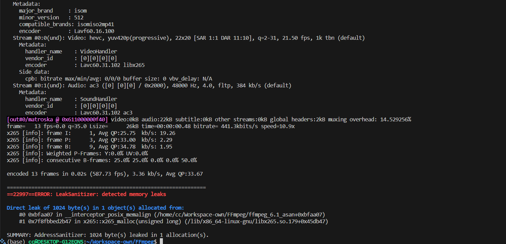

## SUMMARY

memory leak in FFmpeg version 6.1.1 allows a local attacker to Information Disclosure, and cause a denial of service via the poc when use H.265/HEVC as the codec.

How to reproduce:

```bash
./configure --enable-lto --enable-gpl --enable-libx265 --disable-shared --disable-inline-asm --enable-debug=1
./ffmpeg_g -y -i ./poc -c:v libx265 ./test.mkv
```

ASAN Log:

