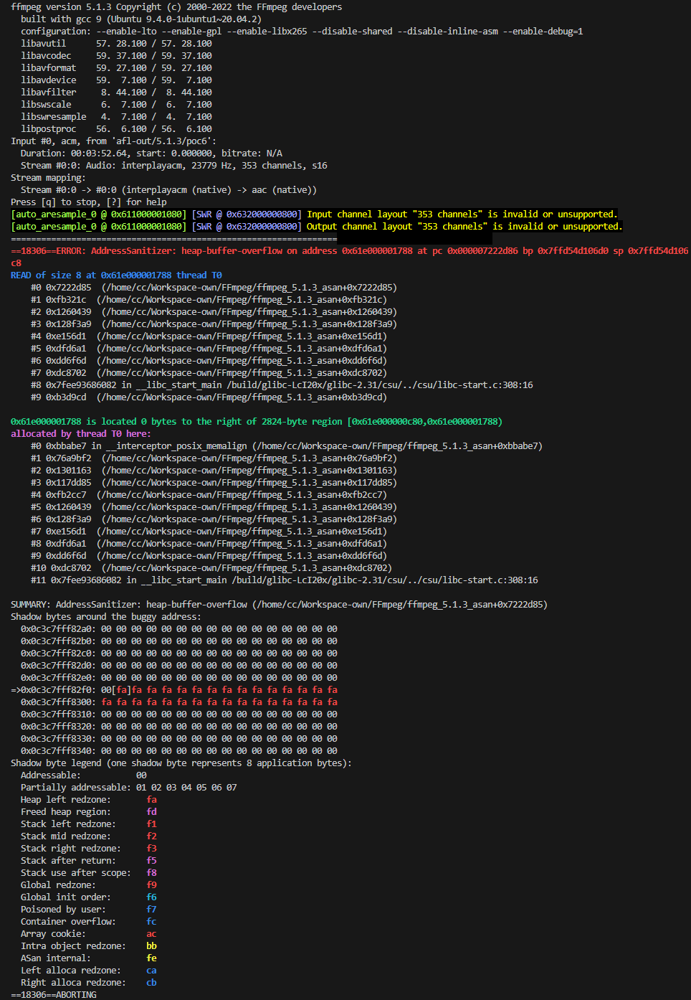

## SUMMARY

heap-buffer-overflow in FFmpeg version 5.1.3 allows a local attacker to execute arbitrary code, and cause a denial of service through a carefully designed POC.

How to reproduce:

```bash
./configure --enable-lto --enable-gpl --enable-libx265 --disable-shared --disable-inline-asm --enable-debug=1
./ffmpeg_g -i ./poc ./test.mp4
```

ASAN Log:

